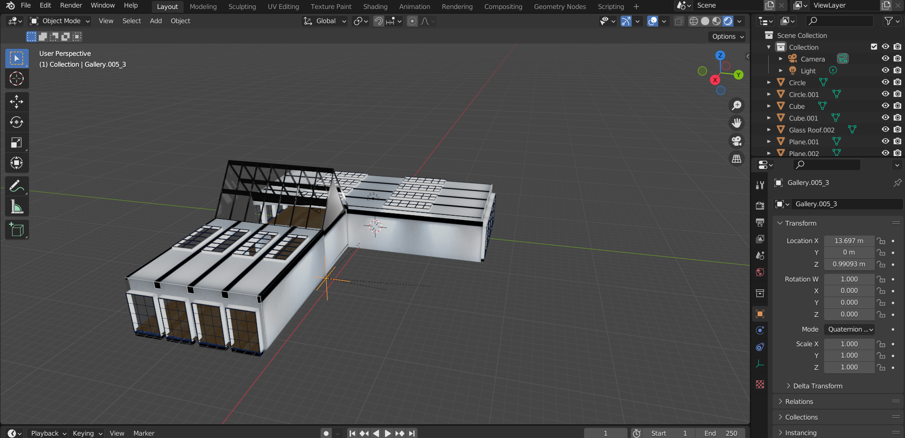
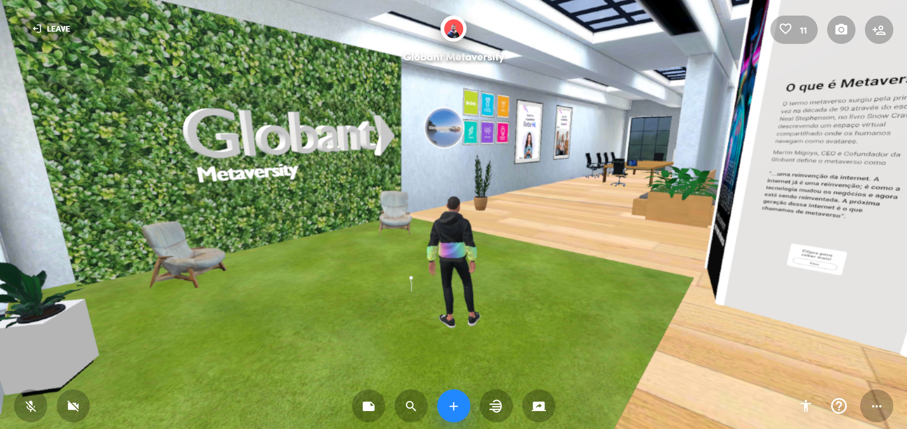

# SpatialMetaversity
Space created in Spatial Metaverse.

:bulb:
I helped in the design and creation of a space, in which the goal is to educate about the metaverse, using Spatial. The environment was built with Blender as well as some objects, others were downloaded from sites like sketchfab.
"Spatial is dedicated to helping creators and brands build their own spaces in the metaverse to share culture together". Spatial empower the users to leverage their beautiful spaces to share eye popping content, build a tight knit community, and drive meaningful sales of their creative works and products, also empowering the users to create beautiful and functional 3D spaces that they can mint as NFTs and sell/rent to others looking to host mind blowing experiences.

:beginner:The image below refers to creating the enviroment in Blender:

:school:The image below is part of the environment that the user has access to:

:point_right:You can access through this link:

https://spatial.io/s/Globant-Metaversity-62ebeb296c09340001ab46e5?share=7447003679941232116
